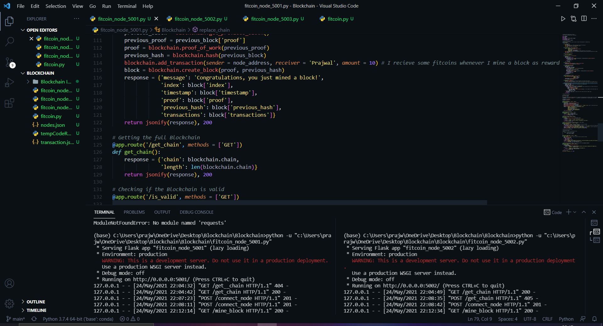
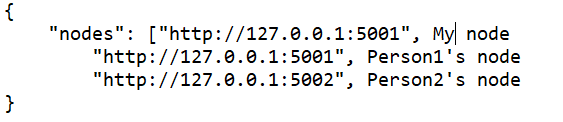
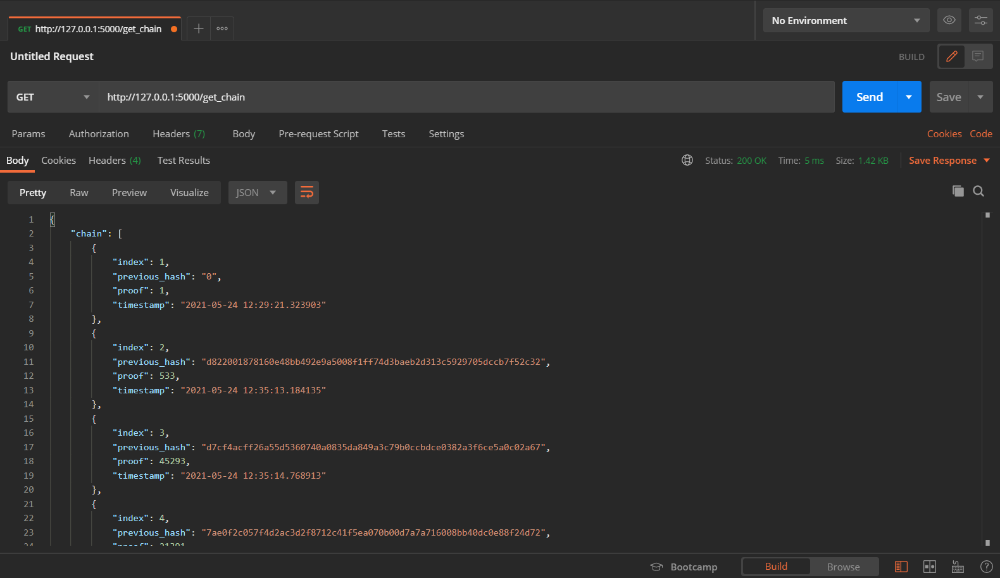
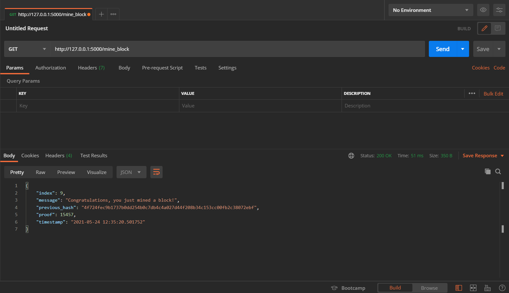

# FITCOIN CRYPTOCURRENCY

I first implemented the Blockchain Technology.
This is capable of mining new blocks, checking if the chain is valid/ invalid and also returns us the chain

# Fitcoin in action

Converted this existing code of Blockchain into a cryptocurrency.
To convert blockchain into the fitcoin cryptocurrency, I added decentralization, transaction functions, and also implemented the consensus algorithm

Nodes.json file contain the addresses of all the nodes who are part of our network:

transaction.json file contains the details on how to add a transaction to a block

To implement decentralization I create 2 more py files, each representing a particular node

I ran the nodes by opening multiple consoles on VS Code

Will soon deploy by creating the front-end part of this cryptocurrency

# get_chain method in POSTMAN

# mine_block method in POSTMAN

